# Inspection Log Records App
  ###### NOTE - APP is currently still in development.  Most logic and back-end work has been completed. APP is mostly functional minus the implantation of MulterJS and CSS work.  MulterJS and CSS is currently being worked on.


## Description:
  ###### Full MEAN stack application that uses Passport for authentication, bcrypt for password hashings and adds a salt to all passwords from client to server side, Angular front-end and an Express/Postgresql back-end to create, maintain and save Fire and Gas Inspection logs that follow NFPA regulations and guidelines.  The application has a User/Employee side and an Admin level to manage inspection details.

- *Desktop Views*

  #### Login
    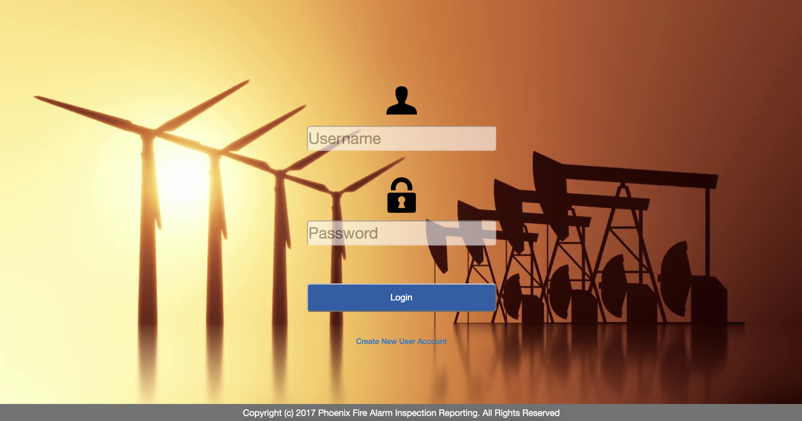

    - ###### Login and Authentiaction is being done with Passport JS and bcrypt.  All passwords are saved in the database hashed.

  #### Dashboard
    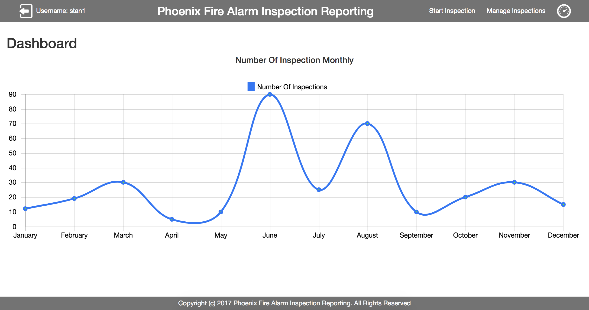

    - ###### Employee/User can see their inspection history viewed on a yearly chart.  Chart shows details on when, where and findings for inspections selected ad index.

  #### Start Inspection
    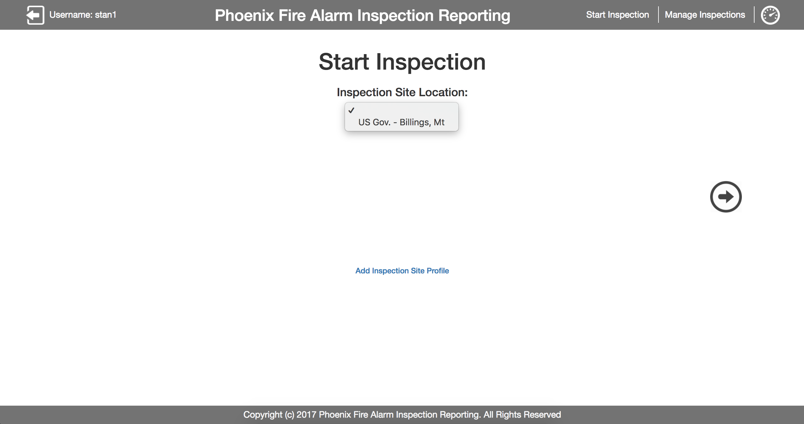

    - ###### Employee/User and select an inspection site to inspect.  The select option only shows inspections sites that pertain to the employee/user's company ID number. Select option only displays inspection sites per company ONLY.

  #### Employee Inspection Form Pages (6 total inspection form pages)
    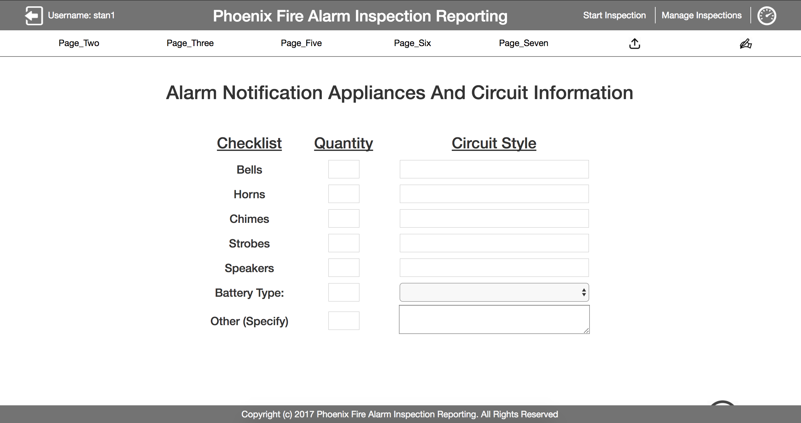

    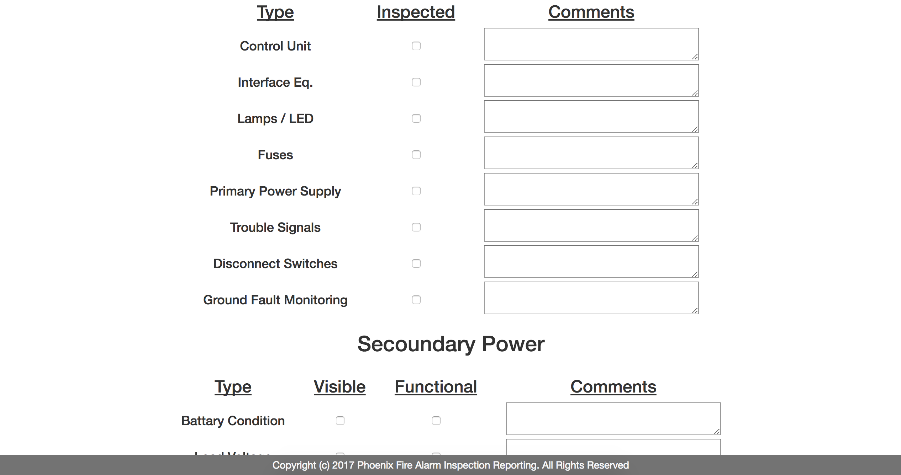

    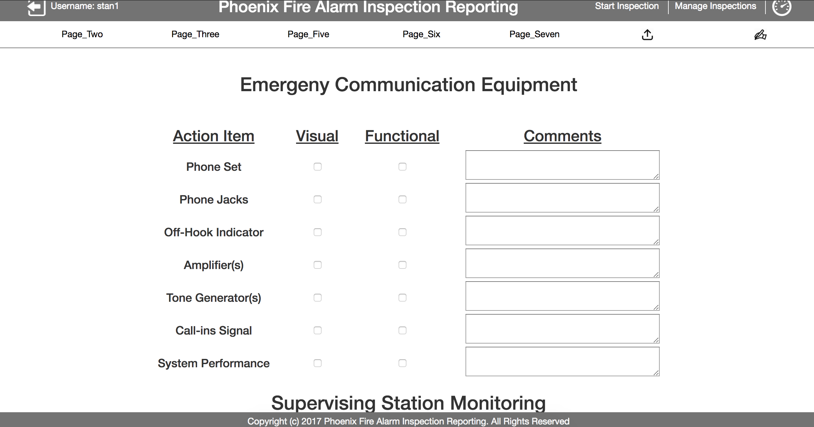

    - ###### There are a total of 7 inspection forms to be completed at each inspection site.  The inspector also has the ability to file upload pictures and make comments to store at DB for future use.

  #### Employee Inspection Signature
    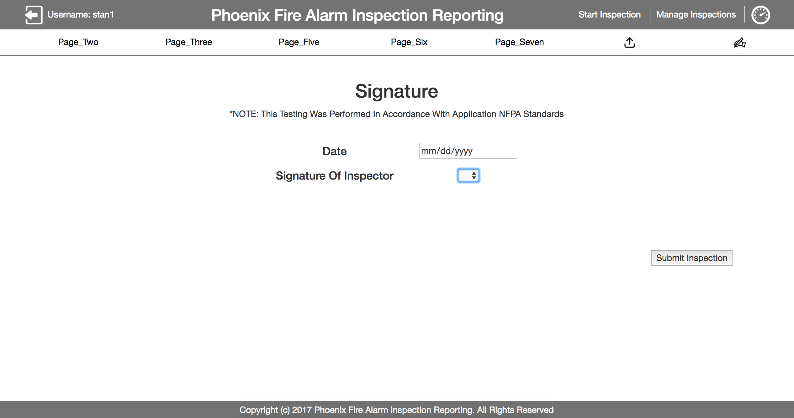

    - ###### After inspection is completed the Employee/user must select the current date and find their name in the select option to pass as the signature.  Once completed, The inspection site will be removed from the "inspections to do" and filed at the DB for analytics.

  #### Employee Manage Inspections
    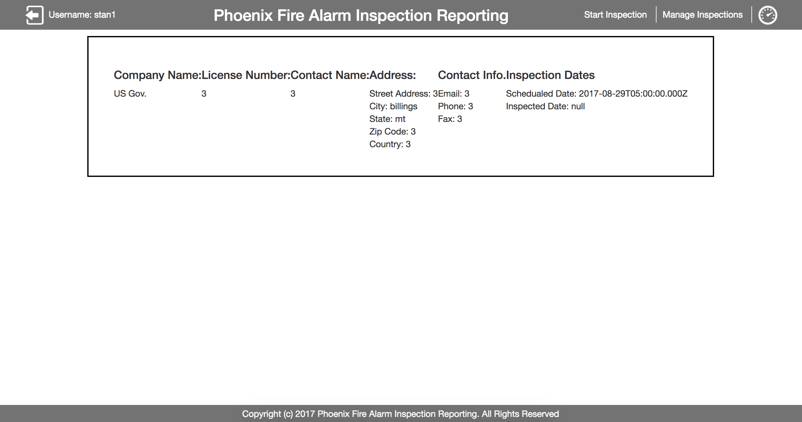

    - ###### Employee/User as the ability to see their past inspection forms.

  #### Admin Add User/Employee
    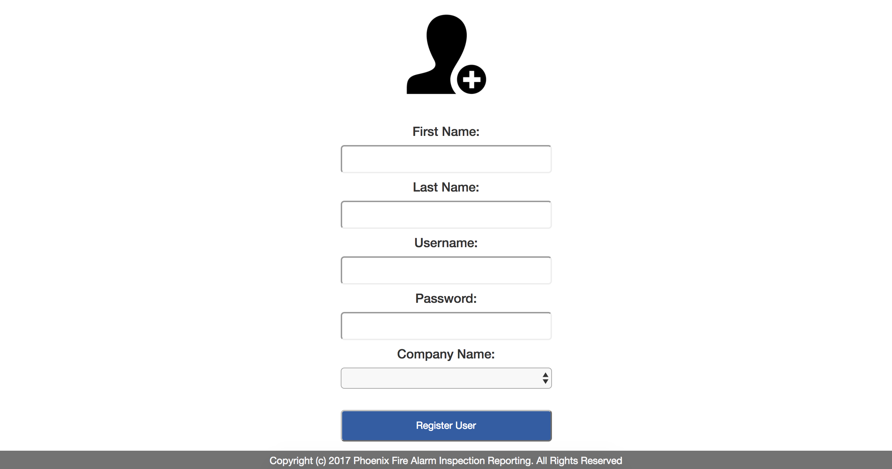

    - ###### Admin can add Employee/User profile to DB

  #### Admin Add Company Profile
    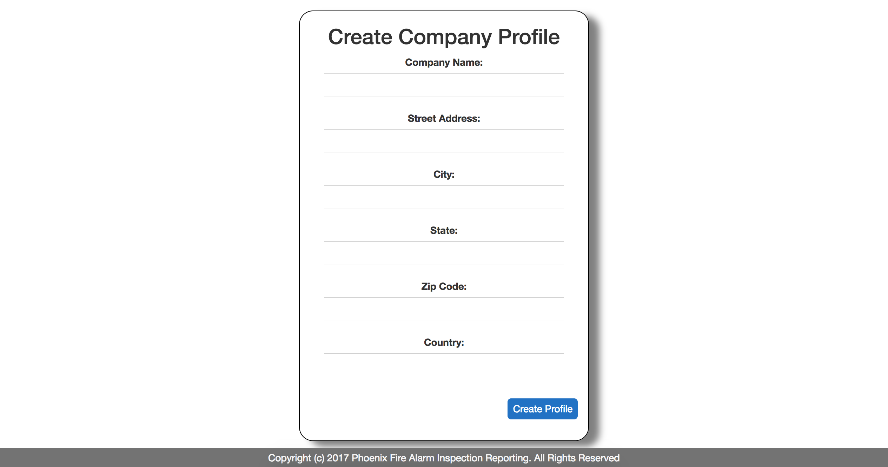

    - ###### Admin can add Company profile to DB

  #### Admin Add Inspection Site Profile
    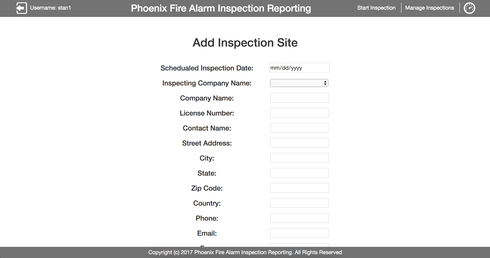

    - ###### Admin can add Inspection Site to DB


## Technologies Used:
#### Front-End:
  - HTML5
  - CSS3
  - Flex Box
  - AngularJS
  - Angular-Route
  - Nodemailer
  - SweatAlerts 2
  - Alertify
  - ChartJS

#### Back-End:
  - PostgresSQL
  - NodeJS
  - PassportJS
  - Passport-local
  - ExpressJS
  - Express-Sessions
  - Body-Parser
  - Multer
  - bcrypt
  - dotenv


## Install App:
  1. Download zip file
  2. Open terminal and navigate into folder
  3. Configure / Create DB
    - Download and install SQL DB client to aide in creating the DB
    - Cut and paste code from database.sql file into 3rd party software from the step pervious
  4. Run commands:
    - ``` npm install ``` Installs Node Packages including dependencies from package.json
    - ``` brew services start postgresql ``` Starts DB server connection to Postico (or equivalent for MongoDB)
    - ``` npm start ``` Starts server
    - ``` npm test ``` Starts server using Nodemon
  5. Server is listening on port: 5000


## License:
##### Copyright 2017 Christopher J. Stanton

###### Permission is hereby granted, free of charge, to any person obtaining a copy of this software and associated documentation files (the "Software"), to deal in the Software without restriction, including without limitation the rights to use, copy, modify, merge, publish, distribute, sublicense, and/or sell copies of the Software, and to permit persons to whom the Software is furnished to do so, subject to the following conditions:

###### The above copyright notice and this permission notice shall be included in all copies or substantial portions of the Software.

###### THE SOFTWARE IS PROVIDED "AS IS", WITHOUT WARRANTY OF ANY KIND, EXPRESS OR IMPLIED, INCLUDING BUT NOT LIMITED TO THE WARRANTIES OF MERCHANTABILITY, FITNESS FOR A PARTICULAR PURPOSE AND NONINFRINGEMENT. IN NO EVENT SHALL THE AUTHORS OR COPYRIGHT HOLDERS BE LIABLE FOR ANY CLAIM, DAMAGES OR OTHER LIABILITY, WHETHER IN AN ACTION OF CONTRACT, TORT OR OTHERWISE, ARISING FROM, OUT OF OR IN CONNECTION WITH THE SOFTWARE OR THE USE OR OTHER DEALINGS IN THE SOFTWARE.
